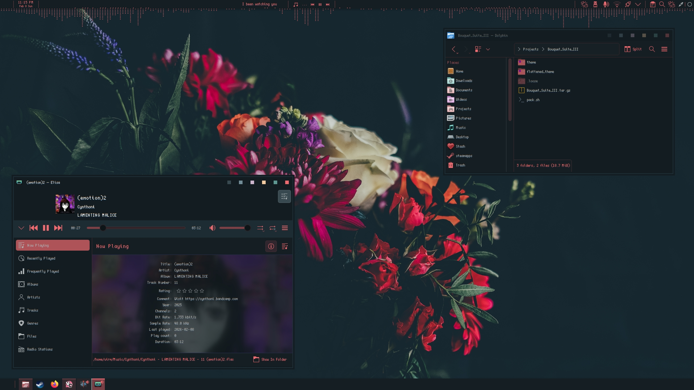

# ABOUT
Made with love by VIRMSKVLL, Bouquet Suite III is an adaption of Niivu's Bouquet theme(s) for Windows.

This theme includes:
- Fully adapted window decorations
- The Bouquet color scheme
- Complimentary wallpapers
- New original start logo made by VIRMSKVLL
- A restored copy of the Scientifica font (No clue why that was basically lost media)
- An updated version of the Bouquet light and dark cursor-set with better loading animations 
`(colors are kept but spinner spins correctly)`
- A matching windows.theme file for Proton/Wine
- Matching transparent icons for Hammer++ for the source engine nerds out there
- A modified matching version of refact0r's system24 Discord theme
- Bonus Library Icons from the original theme

`Layout not yet included`

# HOW TO INSTALL:
1. Merge included '.local' with your user`s '.local' folder
2. Select global theme
3. Make your own layout like a boss
4. Go to font settings and change font styles for all fonts to be `scientifica 10pt`
5. Select optional branding icons for control center and start orb from the extra included icons (also locatable under .local/share/icons/bouquet-extra)
5.a. Right click your library folders and swap their icons with the included .ico files from the bouquet-extra icon pack 
`(not searchable from the icon search, will be changed in the future)`
 
# HOW TO INSTALL PROTON/WINE THEME
1. for proton users install protontricks, for wine users use winetricks.
1.a. Select the prefix of the app you wish to skin
2. open winecfg open the Desktop Integration tab.
3. select the (No Theme) option from the option of themes
4. click install and install the `bouquet_wine.theme` from the `z:/` mount NEVER USE A SYMBOLIC LINK OR IT WILL FAIL TO INSTALL

# FOR HAMMER USERS
1. go to your install of hammer++ under your game's bin folder
2. go to the hammerplusplus/bin folder and replace `hammerplusplus.dll` with the included themed `hammerplusplus.dll`

# FOR THE DISCORD THEME
1. install custom discord client like Vesktop
2. open themes folder and add system24.css theme :3

# CLOSING NOTES AND CREDITS  (contact for credit addition or content removal): 
## (TODO: MAKE MORE DETAILED)
- Cursors are modified from their original state, included theme assets were painstakingly made by VIRMSKVLL
- Original Bouquet start logo by VIRMSKVLL
- Scientifica Font by Niivu (presumably I'm not sure due to it being lost media now but being part of the original Suite)
- Color scheme and original design concept by Niivu
- Original unmodified cursors by Niivu
- Extra icons for explorer from Newatta ripped by Niivu i think???
- Wallpapers include credits were possible from memory, though some have been colour alterered to fit the theme I understand that is not room to take full credit.
- Modified system24 Discord Theme by refact0r 
- Hammer++ assets dll belongs to Hammer++ and the valve corperation.
